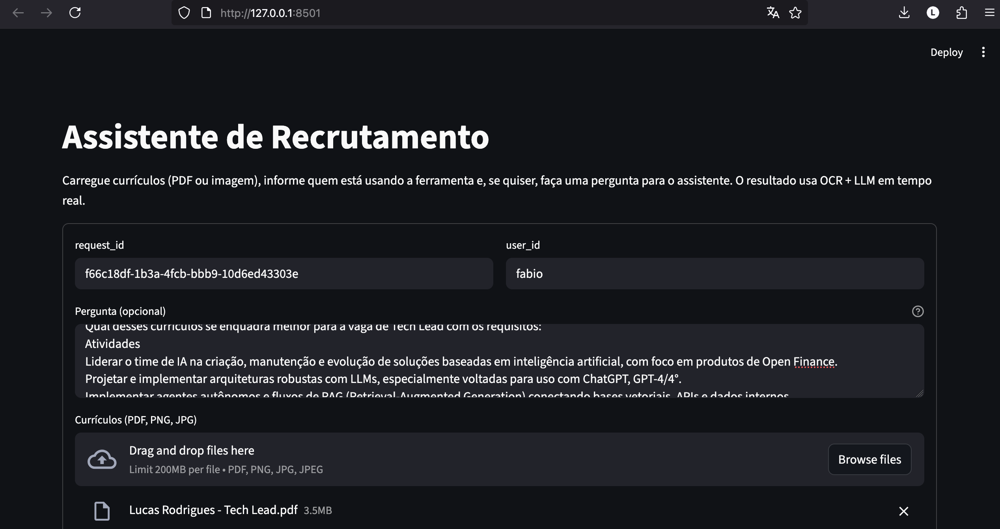
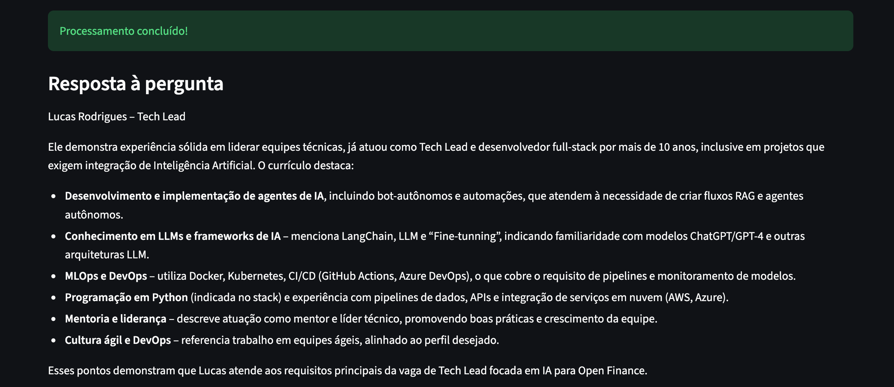
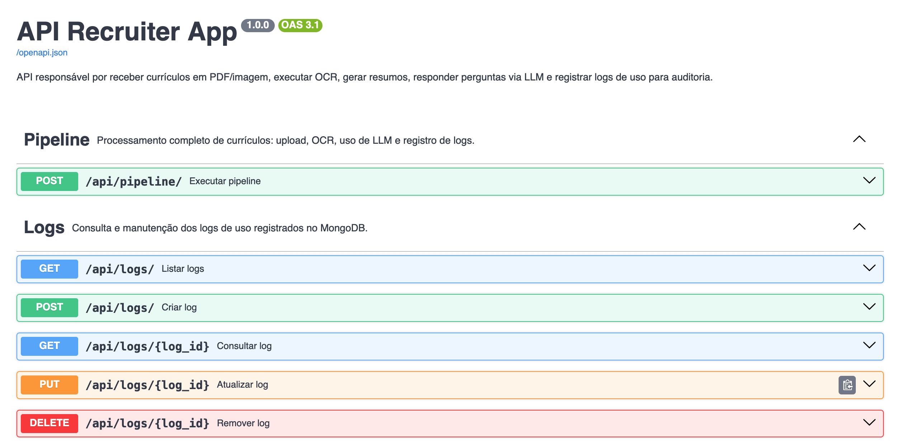

# Recruiter App

### CONCEITOS ###
Este projeto apoia times de recrutamento ao combinar OCR e modelos de linguagem para analisar currículos em PDF ou imagem e responder perguntas específicas sobre os candidatos. O usuário envia um lote de arquivos, informa `request_id`, `user_id` e opcionalmente um $PROMPT — por exemplo:

```
$PROMPT: Qual desses currículos se enquadra melhor para a vaga de Tech Lead com os requisitos: [...]
```

Quando há pergunta, o sistema retorna apenas os candidatos aderentes com suas justificativas; sem pergunta, devolve sumários de cada currículo.

### RESULTADOS ###
- Currículos compatíveis são destacados com justificativa baseada no conteúdo do documento.
- Quando nenhum candidato atende, a resposta deixa isso explícito.
- Evidências rápidas:
  - 
  - 

### COMO EXECUTAR O PROJETO ###
1. Pré-requisitos: Docker e Docker Compose (plugin `docker compose`).
2. Clone o repositório e acesse a pasta do projeto.
3. Copie o arquivo `.env.example` para `.env` e preencha ao menos `LLM_PROVIDER` e `LLM_API_KEY`. Nos testes utilizamos **Groq** (`LLM_PROVIDER=groq`), mas também é possível usar OpenAI, OpenRouter, DeepSeek ou qualquer provedor compatível suportado pelo utilitário (`src/utils/llm_settings.py`).
4. Suba os serviços:
   ```sh
   docker compose up --build
   ```
5. Acesse:
   - Interface Streamlit: `http://localhost:8501`
   - Swagger da API: `http://localhost:8000/docs`
6. Para encerrar:
   ```sh
   docker compose down
   ```

### ARQUITETURA DO PROJETO ###
- **API (FastAPI)**: orquestra OCR, LLM e persistência de logs em MongoDB.
- **Interface (Streamlit)**: permite upload dos currículos, envio do $PROMPT e visualização do resultado.
- **Infra**: OCR via `pytesseract`, `pdf2image`, `Pillow`; integração LLM via `openai` (ou `ai-sdk`, se preferir outro provedor compatível); tudo containerizado com Docker Compose.
- Estrutura resumida:
  ```
  .
  ├── docker-compose.yml
  ├── Dockerfile
  ├── server.py
  ├── streamlit_app.py
  ├── src
  │   ├── infra/database
  │   ├── modules
  │   │   ├── logs
  │   │   ├── pipeline
  │   │   └── chatbot/ocr (serviços de apoio)
  │   └── utils
  └── doc
      ├── doc.md
      ├── evidences
      └── sample.txt
  ```

### TECNOLOGIAS UTILIZADAS ###
- FastAPI, Uvicorn
- AI SDK (Possibilita o usdo de multi providers)
- pytesseract, pdf2image, Pillow
- Streamlit
- MongoDB
- Docker & Docker Compose
- Python 3.11

### ENDPOINTS DISPONÍVEIS NA API ###
- `POST /api/pipeline/` — Executar pipeline (upload dos arquivos, geração de sumários ou resposta usando o LLM).
- `GET /api/logs/` — Listar logs.
- `GET /api/logs/{log_id}` — Consultar log.
- `POST /api/logs/` — Criar log manualmente.
- `PUT /api/logs/{log_id}` — Atualizar log.
- `DELETE /api/logs/{log_id}` — Remover log.
- `GET /health` — Verificar saúde da API.

### DOCUMENTAÇÃO DA API ###
- Swagger/OpenAPI disponível em `http://localhost:8000/docs`.
- Evidência:
  
